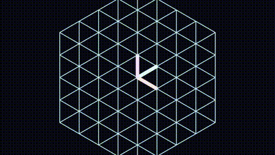
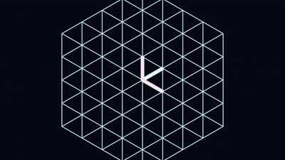

# 🌌 Linear Algebra Visual Engine — 3D
### Project 02 — 3D Linear Transformation Animator

> *"2D was the proof. 3D is the universe."*


---

## 🎬 Cinematic Renders — 1920×1080 · 60fps · EEVEE

| Rotate X 90° | Shear X along Z |
|:---:|:---:|
|  |  |
| Barrel roll — Y folds into -Z | Top of cube pushed sideways |

| Scale 2x | Collapse Z |
|:---:|:---:|
|  |  |
| Universe expands in all 3 directions | 3D space crushed flat — det = 0 |

---

## 🧠 What's New vs Project 01

| Feature | Project 01 (2D) | Project 02 (3D) |
|---|---|---|
| Matrix size | 2×2 | **3×3** |
| Grid | Flat 2D dot grid | **3D Space Lattice** |
| Basis vectors | î ĵ (2 arrows) | **î ĵ k̂ (3 arrows)** |
| Colors | Red + Teal | **Red + Cyan + Magenta** |
| Camera | Top-down orthographic | **Isometric diagonal** |
| Presets | 8 | **6 (true 3D transforms)** |

---

## 🔬 The 6 Presets

```
identity        → No change — baseline
rotate_z_90     → Spinning top — Z-axis rotation, det = 1
rotate_x_90     → Barrel roll — X-axis rotation, det = 1
scale2x         → Expand universe ×2 in all 3 directions, det = 8
shear_x_along_z → Push top of cube sideways, det = 1
collapse_z      → Crush 3D into flat 2D plane, det = 0
```

---

## 🏗️ Architecture

```
Phase_1_Logic/
└── matrices.py         ← Six 3×3 transformation matrices + presets dict

Phase_2_Blender/
├── scenes/
│   └── transform.py    ← Entry point — set PRESET_NAME and run in Blender
└── utils/
    ├── materials.py    ← RGB neon palette (Red · Cyan · Magenta · Teal)
    ├── scene_builder.py← 3D Space Lattice + 3 basis arrows + isometric camera
    └── animator.py     ← Shape Keys — 3D XYZ lerp animation
```

---

## 🚀 Quick Start

```
1. Open Blender 5.x
2. Scripting tab → Open → Phase_2_Blender/scenes/transform.py
3. Set PRESET_NAME = "rotate_x_90"
4. ▶ Run Script
5. Render → Render Animation  (Ctrl+F12)
```

---

## 📐 Part of the Simulation Architect Path

| # | Project | Status |
|---|---|---|
| 01 | 2D Linear Transform Animator | ✅ Complete |
| **02** | **3D Linear Transform Animator** ← *here* | ✅ Complete |
| 03 | Coordinate System Translator | ⏳ |
| 04 | Geometric Linear System Solver | ⏳ |
| 05 | Eigenvector Explorer | ⏳ |
| 06A | Solar System Simulator | ⏳ |
| **06B** | **PROJECT VOID** | ⏳ |
| 07 | Neural Network Visual Simulator | ⏳ |
| 08 | Optical Fiber Simulator | ⏳ |
| 09 | VOID AI — RL Navigator | ⏳ |
| 10 | Omniverse Digital Twin | ⏳ |

---

## 👨‍💻 Author

**Divyansh Ailani** — Simulation Architect in progress

*BCA Student · Kanpur, India → The World*

> "Mathematics is the language of the universe. I am learning to read it."

[](https://www.linkedin.com/in/divyansh-ailani-225925380/)
[](https://github.com/divyanshailani)

---

*Part of the **Simulation Architect Path** — from linear algebra to NVIDIA Omniverse. 🌌*
